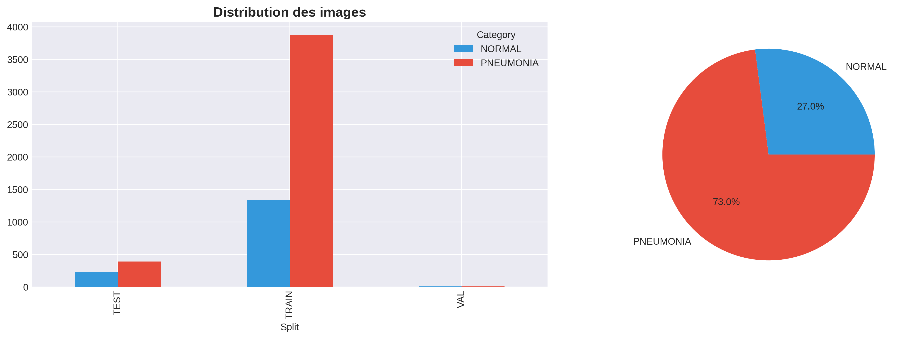

# 📊 Data Exploration Report - Pediatric Pneumonia Detection

**Data Engineer:** Bouhmidi Amina Meroua  
**Date:** 2026-02-18  
**Project:** AI-Powered Early Pediatric Pneumonia Detection:
Integration with Electronic Medical Records in Algeria

---

## 1️⃣ Dataset Overview

### Source
- **Primary Dataset:** [Chest X-Ray Images (Pneumonia)](https://www.kaggle.com/datasets/paultimothymooney/chest-xray-pneumonia)
- **Size:** ~2GB (5,863 images)
- **Format:** JPEG, Grayscale
- **Classes:** NORMAL vs PNEUMONIA (binary classification)

### Clinical Context

Pediatric pneumonia is a leading cause of mortality in children under 5 years old globally.
Chest X-rays are a primary diagnostic tool but interpretation depends heavily on radiologist expertise.

Automated detection can:
- Support clinical decision-making
- Reduce diagnosis time
- Improve access in resource-limited regions (e.g., rural Algeria)


### Dataset Split
| Split      | NORMAL | PNEUMONIA | Total |
|------------|--------|-----------|-------|
| Training   | 1,341  | 3,875     | 5,216 |
| Validation | 8      | 8         | 16    |
| Test       | 234    | 390       | 624   |
| **TOTAL**  | **1,583** | **4,273** | **5,863** |

---

## 2️⃣ Key Findings

### ⚠️ Critical Issues Identified

1. **Class Imbalance** (2.7:1 ratio)
   - NORMAL: 27% (1,583 images)
   - PNEUMONIA: 73% (4,273 images)
   - **Impact:** Model may be biased toward predicting Pneumonia
   - **Solution:** Class weights + selective data augmentation

2. **Insufficient Validation Set** (only 16 images!)
   
    -The validation set (0.27% of total data) is statistically insufficient for reliable performance estimation.
    - Too small for reliable model validation
    - **Solution:** Re-split dataset to 70/15/15 ratio

3. **Variable Image Dimensions**
   - Range: 384×127 to 2,916×2,713 pixels
   - Average: ~1,500×1,200 pixels
   - **Solution:** Resize all images to 224×224

4. **Non-normalized Pixel Values**
   - Current range: 0-255
   - **Solution:** Normalize to [0-1] for stable training

### 📈 Image Statistics

**Dimensions:**
- Min size: 384×127 pixels
- Max size: 2,916×2,713 pixels
- Average: ~1,500×1,200 pixels

**Pixel Intensity (0-255 scale):**
- NORMAL images: Mean ~127, StdDev ~58
- PNEUMONIA images: Mean ~135, StdDev ~54
- Observation: PNEUMONIA images slightly brighter (white infiltrations)

## 📊 Visualizations

### 1. Class Distribution


### 2. Sample Images


### 3. Image Dimensions


### 4. Pixel Intensity Distribution


---

## 3️⃣ Data Quality Assessment

✅ **Strengths:**
- Large training set (5,216 images)
- Clear visual differences between classes
- Consistent image format (grayscale X-rays)
- Well-organized directory structure

⚠️ **Weaknesses:**
- Severe class imbalance
- Inadequate validation split
- Variable image dimensions
- No metadata (patient age, severity, etc.)

---

## 4️⃣ Preprocessing Strategy

Based on the exploration, the following preprocessing pipeline will be implemented:

### Phase 1: Data Reorganization
1. ✅ Combine all images from train/val/test
2. ✅ Create new balanced split: 70% train / 15% val / 15% test
3. ✅ Ensure class distribution is maintained in each split

### Phase 2: Image Preprocessing
1. ✅ Resize all images to 224×224 (VGG16/ResNet50 standard)
2. ✅ Normalize pixel values [0-255] → [0-1]
3. ✅ Convert to appropriate format for model input

### Phase 3: Class Balancing
1. ✅ Calculate class weights (sklearn.utils.class_weight)
   - NORMAL weight: ~2.7
   - PNEUMONIA weight: ~0.6
2. ✅ Apply selective data augmentation on NORMAL class

### Phase 4: Data Augmentation (Training only)
- Rotation: ±15 degrees
- Horizontal flip: Yes
- Zoom: 10%
- Width/Height shift: 10%
- **Note:** No vertical flip (anatomically incorrect)

---

## 5️⃣ Expected Outcomes

After preprocessing:
- **Balanced effective dataset** through class weights
- **Consistent image dimensions** (224×224×1)
- **Normalized inputs** for stable training
- **Adequate validation set** (>800 images)
- **Enhanced training set** via augmentation

---

## 6️⃣ Next Steps

- [ ] Implement preprocessing pipeline
- [ ] Create balanced data loaders
- [ ] Validate preprocessing with sample visualization
- [ ] Generate preprocessed dataset statistics
- [ ] Document preprocessing code in repository

---

## 📎 Appendix

### Code Repository Structure
```
data/
├── raw/                  # Original Kaggle dataset
│   ├── train/
│   ├── test/
│   └── val/
├── processed/            # After preprocessing (to be created)
│   ├── train/
│   ├── val/
│   └── test/
└── exploratory/          # EDA notebooks

notebooks/
├── 01_data_exploration.ipynb
└── 02_preprocessing.ipynb (next)

scripts/
├── analyze_data.py
└── preprocess_data.py (next)
```

### Visualizations Generated
- [x] Class distribution bar chart
- [x] Sample images (NORMAL vs PNEUMONIA)
- [x] Image dimension histograms
- [x] Pixel intensity distributions

---

**Report Status:** ✅ Complete  
**Ready for Preprocessing:** ✅ Yes  
**Reviewed by:** Dr. Abderrahmane Khiat

---