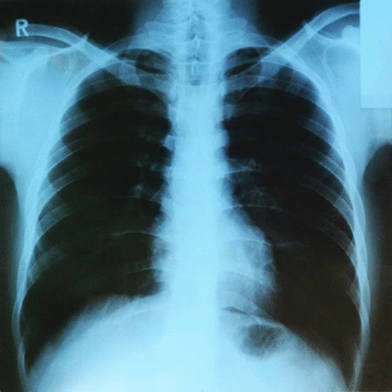

# 🏥 AI-Powered Pediatric Pneumonia Detection

<p align="center">
  
</p>

<p align="center">
  
  
  
  
  
</p>

<h3 align="center">AI-Powered Early Pediatric Pneumonia Detection: Integration with Electronic Medical Records in Algeria</h3>
<p align="center">Leveraging Transfer Learning and Strategic Data Engineering for Clinical-Grade AI</p>

---

## 👥 Team

<table>
  <tr>
    <td align="center"><b>Role</b></td>
    <td align="center"><b>Name</b></td>
  </tr>
  <tr>
    <td>🔧 Data Engineer</td>
    <td>Bouhmidi Amina Meroua</td>
  </tr>
  <tr>
    <td>🤖 ML Engineer</td>
    <td>Labani Nabila Nour El Houda</td>
  </tr>
  <tr>
    <td>📊 Project Manager</td>
    <td>Kassouar Fatima</td>
  </tr>
  <tr>
    <td>📊 Business model</td>
    <td>Miloudi Maroua Amira</td>
  </tr>

  <tr>
    <td>👨‍🏫 Supervisor</td>
    <td>Dr. Abderrahmane Khiat</td>
  </tr>
</table>

**Institution:** University of Saida, Algeria  
 

---

## 🎯 Project Overview

### 💡 Problem Statement

Pneumonia is a **leading cause of death** in children under 5:
- 📊 **740,000+ deaths** annually worldwide (15% of child mortality)
- 🏥 **200-300 cases daily** in Algerian emergency departments
- ⏱️ **6-24 hour** diagnostic delays
- 👨‍⚕️ **Severe shortage** of pediatric radiologists (~1 per 500,000 children)
- 🚗 **40% of children** travel 50-100 km for X-ray access

### ✨ Our Solution

AI-powered detection system through:
- 🧠 **Transfer Learning** (VGG16/ResNet50/DenseNet121)
- ⚖️ **Strategic Class Balancing** (weights: 1.850 / 0.685)
- 🎨 **Intelligent Data Augmentation**
- 🏥 **EMR Integration Ready** (HL7/FHIR standards)

---

## 📊 Project Status

<table>
  <tr>
    <th>Phase</th>
    <th>Status</th>
    <th>Progress</th>
    <th>Deliverables</th>
  </tr>
  <tr>
    <td>📊 Data Exploration</td>
    <td>✅ Complete</td>
    <td>████████████ 100%</td>
    <td>EDA Report, Figures 01-04</td>
  </tr>
  <tr>
    <td>🔧 Data Preprocessing</td>
    <td>✅ Complete</td>
    <td>████████████ 100%</td>
    <td>Preprocessed Dataset, Figures 05-07</td>
  </tr>
  <tr>
    <td>📦 Data Loaders</td>
    <td>✅ Complete</td>
    <td>████████████ 100%</td>
    <td>TF Generators, ML Package</td>
  </tr>
  </table>

---

## 📁 Repository Structure
```
pediatric-pneumonia-detection/
│
├── 📊 data/
│   ├── chest_xray/              # Original dataset (not included)
│   ├── preprocessed/            # Organized dataset (not included)
│   
│
├── 📸 figures/                  # All visualizations
│   ├── 01-04_*.png             # Exploration phase
│   ├── 05-07_*.png             # Preprocessing phase
│   ├── 08-09_*.png             # Data loaders phase
│   └── xray-heart.gif              # README banner
│
├── 📓 notebooks/
│   ├── 01_Data_Exploration_EDA.ipynb
│   ├── 02_Data_Preprocessing.ipynb
│   └── 03_Data_Loaders.ipynb
│
├── 📄 reports/
│   ├── DATA_EXPLORATION_REPORT.md
│   ├── DATA_PREPROCESSING_REPORT.md
│   └── DATA_LOADERS_REPORT.md
│
├── ⚙️ config/
│   ├── preprocessing_config.json
│   └── data_loaders_summary.json
│
├── 🐍 src/
│   └── data_loader.py           # ML Engineer package
│
├── ├── 📖 README.md

```

---

## 🚀 Quick Start

### Prerequisites
```bash
Python >= 3.8
TensorFlow >= 2.10
Keras >= 2.10
```

#
## 📊 Dataset Information

### Original Dataset
- **Source:** [Kaggle Chest X-Ray Pneumonia](https://www.kaggle.com/datasets/paultimothymooney/chest-xray-pneumonia)
- **Total:** 5,856 pediatric chest X-rays (ages 1-5)
- **Classes:** NORMAL (1,583) | PNEUMONIA (4,273)
- **Imbalance:** 2.7:1 ratio

### Preprocessed Dataset

<table>
  <tr>
    <th>Split</th>
    <th>NORMAL</th>
    <th>PNEUMONIA</th>
    <th>Total</th>
    <th>Percentage</th>
  </tr>
  <tr>
    <td><b>Training</b></td>
    <td>1,108 (27.0%)</td>
    <td>2,991 (73.0%)</td>
    <td>4,099</td>
    <td>70%</td>
  </tr>
  <tr>
    <td><b>Validation</b></td>
    <td>237 (27.0%)</td>
    <td>641 (73.0%)</td>
    <td>878</td>
    <td>15%</td>
  </tr>
  <tr>
    <td><b>Test</b></td>
    <td>238 (27.1%)</td>
    <td>641 (72.9%)</td>
    <td>879</td>
    <td>15%</td>
  </tr>
</table>

**Configuration:**
- 📏 Size: 224×224 pixels
- 🎨 Format: Grayscale, normalized [0-1]
- 🔄 Augmentation: Rotation (±15°), Shift (10%), Zoom (10%), Flip

---

## 🔧 Data Engineering Pipeline

### Phase 1: Exploration ✅
- Analyzed 5,856 chest X-rays
- Identified class imbalance (2.7:1)
- Detected validation set issue (16 images → 878 images)
- **Report:** [DATA_EXPLORATION_REPORT.md](reports/DATA_EXPLORATION_REPORT.md)

### Phase 2: Preprocessing ✅
- Reorganized dataset (70/15/15 stratified split)
- Calculated optimal class weights (1.850 / 0.685)
- Implemented intelligent data augmentation
- Created preprocessing pipeline (224×224, normalized)
- **Report:** [DATA_PREPROCESSING_REPORT.md](reports/DATA_PREPROCESSING_REPORT.md)

### Phase 3: Data Loaders ✅
- TensorFlow ImageDataGenerator configuration
- Batch processing (32 images/batch)
- Performance optimization (<0.5s/batch)
- ML Engineer package created
- **Report:** [DATA_LOADERS_REPORT.md](reports/DATA_LOADERS_REPORT.md)

---

---

## 📚 Technical Stack

<p align="center">
  
  
  
  
  
  
</p>

---

## 📖 Documentation

| Document | Description |
|----------|-------------|
| [Data Exploration Report](reports/DATA_EXPLORATION_REPORT.md) | Phase 1: EDA & Analysis |
| [Data Preprocessing Report](reports/DATA_PREPROCESSING_REPORT.md) | Phase 2: Pipeline & Augmentation |
| [Data Loaders Report](reports/DATA_LOADERS_REPORT.md) | Phase 3: TensorFlow Integration |
| [Dataset Documentation](README.md) | Data structure & access |
| [Notebooks](notebooks/) | Interactive code & experiments |

---

## 🎓 Academic Context


**Institution:** University of Saida, Algeria  
**Supervisor:** Dr. Abderrahmane Khiat

---


## 📧 Contact

**Bouhmidi Amina Maroua** - Data Engineer  
📍 University of Saida, Algeria  
📧 [GitHub](https://github.com/AminaMar)

---


